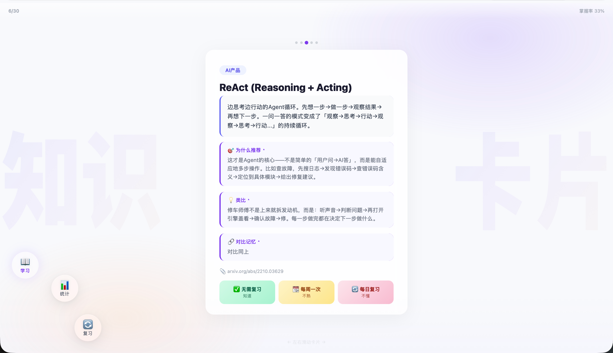

# 📚 AI 知识卡片 · AI Glossary Cards

> 每天 5 张卡片，积累 AI 产品经理必知必会的专业术语。

---

## 🎯 这是什么

一个**开箱即用的交互式学习工具**，帮助你系统掌握 AI 产品经理需要了解的 **100 个专业术语**。

区别于传统术语表，它不只是"翻译"——每个术语都从**产品经理视角**解释：为什么你应该知道它、它和你当前的工作有什么关系。

---

## ✨ 核心功能

| 功能 | 说明 |
|:----|:----|
| **📖 每日学习** | 每天推 5 张卡片，优先复习再学新 |
| **🧠 艾宾浩斯遗忘曲线** | 标记「不懂」的卡片按 1→2→4→7→15→30 天自动安排复习 |
| **🔄 双卡对比** | 相似术语自动以重叠双卡展示，方便对比记忆（RAG ↔ SFT、CoT ↔ ReAct…） |
| **🔤 读音标注** | 英文缩写标音标，中文名词标拼音 |
| **📎 来源链接** | 每个术语附出处，点击可查原文 |
| **📊 学习统计** | 各领域进度条、掌握率、学习天数一目了然 |
| **🎮 多交互方式** | 触控板滑动 / 鼠标拖拽 / 方向键翻卡，随心切换 |

---

## 🗂️ 覆盖 7 大分类

| 分类 | 数量 | 示例 |
|:----|:---:|------|
| 大厂黑话 | 30 | 对齐、闭环、抓手、ROI、PMF、中台、赋能 |
| AI产品 | 20 | RAG、Agent、MCP、Vibe Coding、Prompt Engineering |
| 算法/模型 | 17 | SFT、DPO、CoT、LoRA、Transformer、量化 |
| AI领域 | 10 | 多模态、具身智能、AGI、Scaling Law、世界模型 |
| 人机交互 | 8 | 语音交互、HITL、心流、渐进式披露 |
| 游戏开发 | 8 | 行为树、ECS、帧同步、渲染管线 |
| 脑机接口 | 7 | EEG、fNIRS、Neuralink、Synchron |

---

## 🚀 快速开始

### 方式一：在线使用（推荐）

打开 GitHub Pages 地址即可使用，学习进度自动保存在浏览器中：

```
https://你的用户名.github.io/knowledge-cards/
```

### 方式二：本地运行

```bash
git clone https://github.com/你的用户名/knowledge-cards.git
cd knowledge-cards

# 方式 A：使用 Python 启动本地服务器
python3 -m http.server 8000
# 浏览器打开 http://localhost:8000

# 方式 B：直接打开（会使用内置的 30 张兜底卡片）
open index.html
```

---

## 🖥️ 界面预览



---

## 🎨 设计特点

- **紫橙渐变光感背景** — 轻盈、高级、不刺眼
- **「知识」「卡片」海报艺术字** — 超大半透明背景字，竖向拉长
- **左下 1/4 圆弧导航** — 三个毛玻璃按钮分布弧上，点击放大
- **卡片全屏居中** — 完美适配各种屏幕尺寸
- **弹簧感滑动手势** — 拖拽跟手、弹回自然、滑出果断

---

## 💾 数据与隐私

- 所有学习进度存储在浏览器的 **localStorage**，**不上传任何服务器**
- 卡片数据在 `data/knowledge-cards.json`，**直接编辑即可自定义内容**
- 纯静态页面，无后端、无追踪、无广告

---

## 🧑‍💻 适用人群

- **AI 产品经理** — 面试准备、日常查漏补缺
- **AI 从业者** — 快速了解产品侧关注的技术概念
- **技术转产品** — 补齐 AI 领域基础术语
- **在校学生** — 提前建立 AI 产品知识体系

---

## ✏️ 如何添加新卡片

只需编辑 `data/knowledge-cards.json`，按格式添加即可：

```json
{
  "id": "your-card-001",
  "category": "AI产品",
  "term": "你的术语名",
  "definition": "简单易懂的解释，不要用其它专有名词",
  "why_it_matters": "为什么产品经理应该知道这个",
  "analogy": "一个通俗的类比（可选）",
  "pronunciation": {"en": "/音标/", "cn": "拼音"},
  "source": "https://出处链接",
  "related": ["相关卡片id"],
  "contrast": "对比说明（有 related 时生效）"
}
```

添加后刷新页面即可生效。如需本地测试，运行 `python3 -m http.server`。

---

## 🛠️ 技术栈

- 纯 **HTML + CSS + JavaScript**，零依赖
- 双模式数据加载：在线加载 `data/knowledge-cards.json`，本地用内置兜底
- 数据存储：**localStorage**
- 页面托管：**GitHub Pages**

---

## 📄 License

MIT
